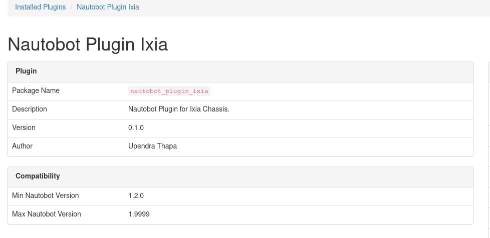
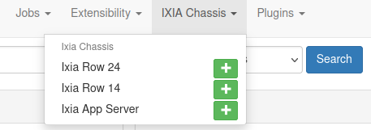
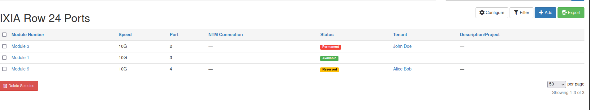
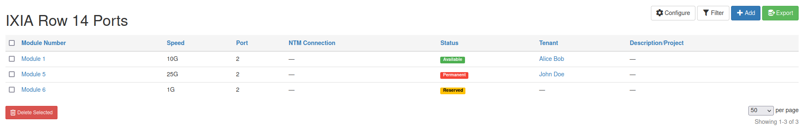
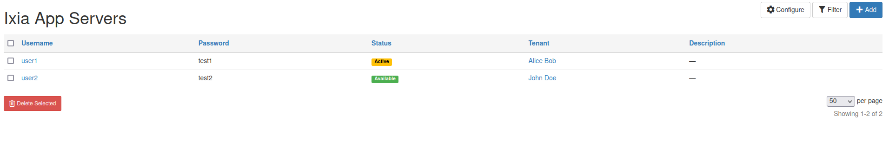
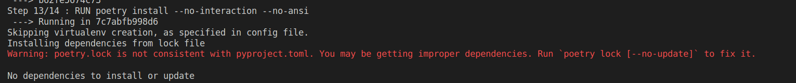

# Custom Nautobot Plugin for Ixia Chassis 

<p align="center">
    
</p>
<h5 align='center'>Development Environment</h5>

<p align='center'>

<a href="https://www.postgresql.org/" target="_blank"></a> <a href="https://www.djangoproject.com/" target="_blank"></a> <a href="https://www.python.org" target="_blank"></a> <a href="https://docs.docker.com/get-docker/" target="_blank"></a> <a href="https://python-poetry.org/" target="_blank"> </a> <a href="https://redis.io/" target="_blank"> <a href="https://code.visualstudio.com/" target="_blank"></a> 

</p>

### Overview
A nautobot plugin for Ixia XGS12 Chassis Platform. The goal of this plugin is to have separate view for Ixia chassis with attributes like modules, tenat, status, port and description.

### Installation
The plugin will be available soon as a Python package in PyPI and can be installed with `pip`:

	$ pip3 install nautobot-plugin-ixia
	
To ensure the nautobot-plugin-ixia is automatically re-installed during the future upgrades, create a file named *local_requirements.txt* (if not already existing) in the Nautobot root directory ( alongside **requirements.txt**) and list the nautobot-plugin-ixia packages :

	$ echo nautobot-plugin-ixia >> local_requirements.txt

Once installed the **nautobot_config.py** needs to be updated with following:

	PLUGINS = ["nautobot-plugin-ixia"]

Testing Locally 

	$ git clone https://github.com/uthapa82/nautobot-plugin-ixia.git

Once cloned, start the development environment 
	
	
	$ poetry shell

	$ poetry install 

	$ invoke build debug
	
### Screenshots
**Verification of Nautobot Plugin Installation**

|  |
|-|

**Nautobot UI Additional Navigation Menu**


|  |
|-|

**Ixia Row 24 Page View** 

|  |
|-|

**Ixia Row 14 Page View**

|  |
|-|

**Ixia AppServer Information Page View**

|  |
|-|

### Known Issue

|  |
|-|

Need to resolve this warning, this seems to be a bug in Poetry itself, [Poetry-Issue-Github](https://github.com/python-poetry/poetry/issues/7211)

Temporary Solution: 
	`$ poetry  lock --no-update`

Solution that worked to fix this warning

	$ cd ~/.cache/pypoetry/cache
	
	$ rm -rf artifcats/


Verification 
	`$ poetry lock --check `


### Useful Commands 
* Docker Status and troubleshooting commands
	```properties
	$ sudo systemctl status docker
	$ sudo systemctl enable--now docker
	$ docker volume ls
	$ doker volume rm <name_of_process_to_remove>
	$ docker ps
	$ docker ps -a 
	$ docker prune 

	# stop exiting redis and postgresql service 
	$ sudo service redis-server stop
	$ sudo service postgresql stop

	# list and kill the postgres and redis ports used 
	$ sudo lsof -i -P -n | grep <5432 or 6379>
	$ fuser -n tcp -k <port_number>
	
	```

* Remove existing virtual environment and recreate 

	```properties
	$ rm -rf~/.cache/pypoetry/virtualenvs/nautobot-plugin-<tab>

	$ poetry shell 
	# might need to select the interpreter explicitly in vscode after this command 

	#uninstall nautobot
	$ pip3 uninstall -y nautobot

* Poetry version and lock file incompatible 
	
	```properties 
	$ poetry lock --no-update
	$ poetry install 
	
	#installing specific version of nautobot 
	$ poetry add nautobot=1.4.5
	$ poetry add nautobot ---> this will install most recent stable version 

	```
* Sudo to nautobot

	`$ sudo -iu nautobot`

* Prepare the Database 

	`$ nautobot-server migrate `	
	
* Create a Superuser 

	`$ nautobot-server createsuperuser`
	
* Starting Nautobot's development server on port XXXX, here 8000

	`$ nautobot-server runserver 0.0.0.0:8000 --insecure`

* #### Steps to import the existing database

	It would be better to DROP the existing database as well as user and create new one, otherwise it might give *"Error:Relation already exists"*

	* DROP the existing database **-CAUTION: Make sure you have backup before dropping**

	```

	user@nautobot-test# sudo -u postgres psql
		postgres=# DROP DATABASE nautobot;
		DROP DATABASE  
		postgres=# DROP USER nautobot;
		DROP ROLE 
		postgres=# \q
	
	```


	* Recreate the database 

	```
	user@nautobot-test# sudo -u postgres psql
		postgres=# CREATE DATABASE nautobot;
		CREATE DATABASE  
		postgres=# CREATE USER nautobot WITH PASSWORD '<-test-password->';
		CREATE ROLE
		postgres=# GRANT ALL PRIVILEGES ON DATABASE nautobot to nautobot;
		GRANT
		postgres=# \q
	
	```

	##### Importing existing database.sql file 
	
	`user@hostname:~$ psql -h hostname -d databasename -U username -f file_name.sql`

	After the above command if it gives error like: 
	
	*psql: could not connect to server: Connection refused" Error when connecting to remote database*
	
	follow the following steps:

	```
	user@hostname:~$ cd /etc/postgresql/<tab for version>/main/
	# ls & open postgresql.conf file 

	user@hostname:~$ sudo nano postgresql.conf 

	# add following line to that file, it might already be there just need to uncomment it 

	listen_addresses = '*'

	# After that open pg_hba.conf file 
	`user@hostname:~$ sudo nano pg_hba.conf' 

	# add the following line 
	host all all 0.0.0.0/0  md5

	```


	* Finally restart the postgresql server 

	`user@hostname:~$  sudo /etc/init.d/postgresql restart `

	Now if you reapply [Importing existing database.sql file](#importing-existing-databasesql-file) command it should work

 	##### Verify the database 

	```
	user@nautobot-test# sudo -u postgres psql
		postgres=# \list 
		# Your existing list of databases will be shown
		
		#connect the database you created 
		postgres=# \connect nautobot
		You are now connected to database "database name" as user "username"

		#list the tables 
		postgres=# \dt 

		# List of relations will be shown
		..................................
		postgres=# \q
	
	```

### Documentation-References-Acknowledgements
* [Official Nautobot Docs](https://docs.nautobot.com/)
* [Code Reference](https://docs.nautobot.com/projects/core/en/stable/plugins/development/#extending-object-detail-views)
* Existing Plugin used as a Reference for this development
	* [nautobot-plugin-golden-config](https://github.com/nautobot/nautobot-plugin-golden-config)
	* [nautobot-plugin-netbox-importer](https://github.com/nautobot/nautobot-plugin-netbox-importer)
	* [nautobot-polugin-data-validation-engine](https://github.com/nautobot/nautobot-plugin-data-validation-engine)

* Special thanks to [Ken Celenza](https://github.com/itdependsnetworks) Director of Network Automation @Network to Code, [Jeremy White](https://www.linkedin.com/in/whitej6/) Principal Developer at Network To Code & [nautobot slack community](http://slack.networktocode.com/) for answering the questions and guidelines
